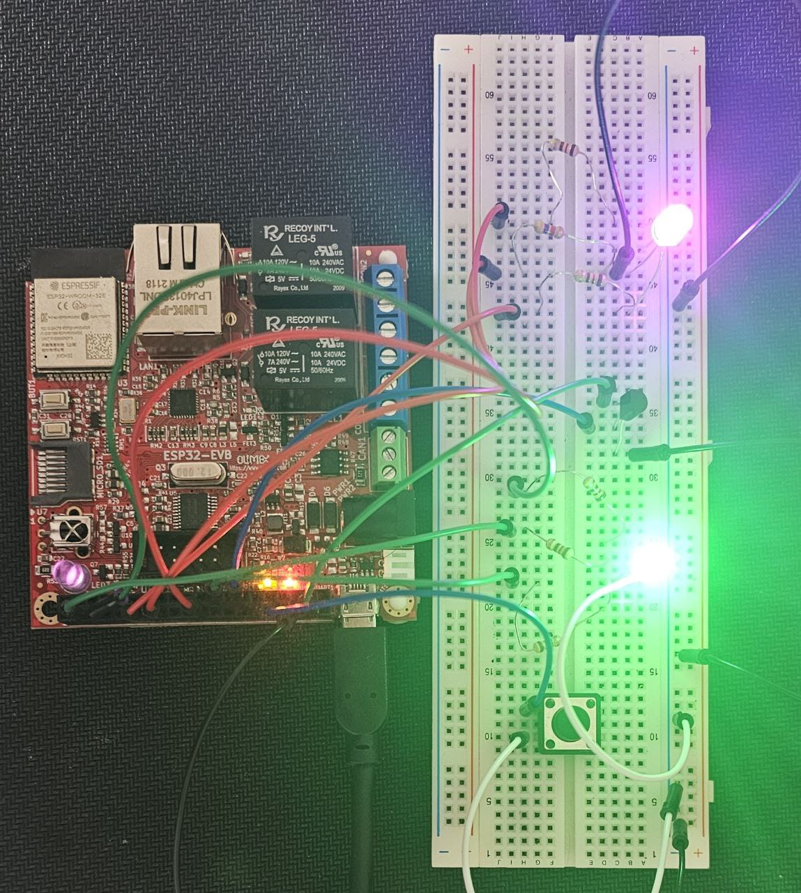

# SmartTempGuard 🌡️🔴🟢🔵  
**A Dual-Mode ESP32 Temperature Monitoring System with RGB LED Feedback**

## 🚀 Overview

**SmartTempGuard** is an ESP32-based embedded system that monitors ambient temperature using an analog temperature sensor and visually represents the result using RGB LEDs. It features:

- Real-time temperature monitoring.
- RGB LED indicators for temperature zones (cold, comfort, hot).
- Two operational modes: **Monitor** and **Set**.
- User-adjustable temperature threshold via Serial.
- Task-driven architecture using FreeRTOS.

---

## 📦 Features

- 🧠 **Monitor Mode**: Continuously reads temperature and displays status via RGB LED 1.
- ✍️ **Set Mode**: Allows user to set a custom temperature threshold via Serial.
- 🔁 **FreeRTOS Multi-tasking**: Concurrent tasks for temperature, button, mode LED, and Serial.
- 🔵🔴🟢 **Dual RGB LEDs**:
  - LED1: Temperature status.
  - LED2: Current mode.

---

## 🧰 Hardware Requirements

- **ESP32** development board
- Analog temperature sensor (e.g., TMP36) connected to **GPIO32**
- Push-button connected to **GPIO34**
- Two common cathode RGB LEDs connected to:
  - RGB1 (status): RED → GPIO25, GREEN → GPIO2, BLUE → GPIO4
  - RGB2 (mode): RED → GPIO21, GREEN → GPIO14, BLUE → GPIO12
- USB cable for Serial and power

---

## ⚙️ Software Requirements

- [Arduino IDE](https://www.arduino.cc/en/software) or [PlatformIO](https://platformio.org/)
- ESP32 board support via Board Manager
- FreeRTOS (included in ESP32 core)

---

## 📐 Wiring Diagram

| Component         | ESP32 Pin |
|------------------|-----------|
| TMP36 Sensor      | GPIO32    |
| Button            | GPIO34    |
| RGB LED1 Red      | GPIO25    |
| RGB LED1 Green    | GPIO2     |
| RGB LED1 Blue     | GPIO4     |
| RGB LED2 Red      | GPIO21    |
| RGB LED2 Green    | GPIO14    |
| RGB LED2 Blue     | GPIO12    |

---

## 🧪 Operating Modes

### 1. Monitor Mode
- Reads temperature every second.
- RGB LED 1 indicates:
  - 🔵 **Blue** = Cold (below threshold - 1.5 °C)
  - 🟢 **Green** = Comfort (within ±1.5 °C of threshold)
  - 🔴 **Red** = Hot (above threshold + 1.5 °C)

### 2. Set Mode
- Toggle mode using the button.
- Enter new threshold via Serial.
- Returns to Monitor Mode automatically.

---

## 🧵 Serial Commands

- While in **Set Mode**, type a number (e.g., `26.5`) and press **Enter**.
- Valid input range: **-100°C to 150°C**
- Invalid input returns: `Invalid input. Try again.`

---

## 📊 Serial Output Example

Current Temperature: 26.40 °C, Threshold: 25.00 °C  
Current Temperature: 27.10 °C, Threshold: 25.00 °C  
Threshold updated to: 26.50 °C  

---
## 🧩 Task Overview

| Task Name     | Functionality                             |
|---------------|--------------------------------------------|
| `TempTask`    | Measures and evaluates temperature         |
| `ButtonTask`  | Detects button press and toggles mode      |
| `ModeLedTask` | Shows current mode via RGB2                |
| `SerialTask`  | Gets user input and updates threshold      |
| `setupPWM`    | Sets up PWM channels for all RGB pins      |

---

## 🧪 How to Use

1. Clone or download this repository.
2. Open the project in **Arduino IDE** or **PlatformIO**.
3. Connect your **ESP32** and select the correct port and board.
4. Upload the code to your ESP32.
5. Open the **Serial Monitor** at **115200 baud**.
6. Use the **button** to toggle between **Monitor** and **Set** mode.

---
